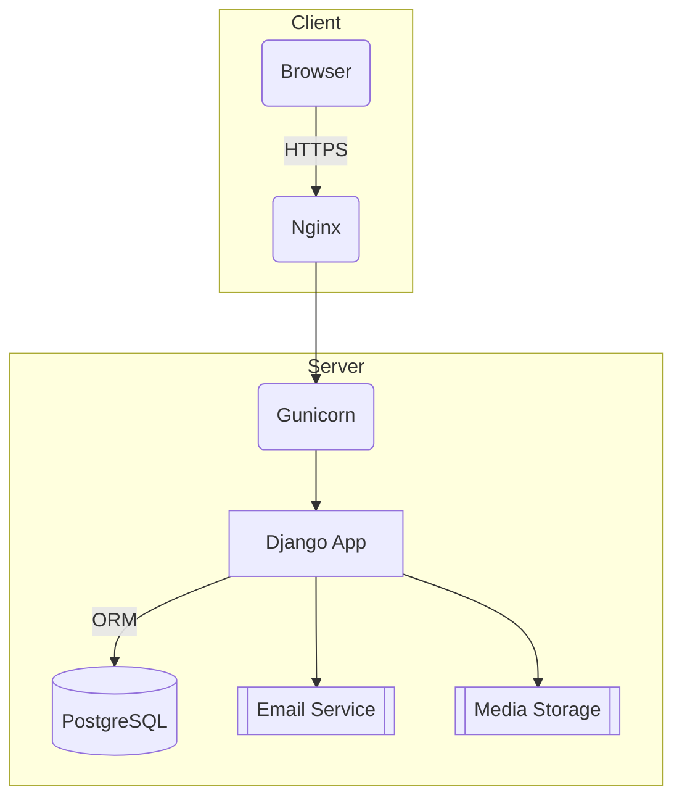

# 🏠 RealHome — Full-Stack Real-Estate Platform Powered by Django

RealHome is a **production-ready real-estate web application** where visitors browse dream properties, contact agents, and schedule viewings, while administrators manage listings, realtors, and user inquiries — all built with Django’s robust ecosystem.

---

## 🚀 Feature Highlights

| Category                   | Capabilities                                                                  |
|----------------------------|-------------------------------------------------------------------------------|
| **User Experience**        | Responsive UI, property gallery with high-resolution photos, intuitive search & filters (price, bedrooms, city, status) |
| **Authentication**         | Secure registration / login, password reset, profile dashboard               |
| **Listings Management**    | REST-like CRUD via Django Admin or custom dashboard; bulk image upload        |
| **Realtor Directory**      | Dedicated pages with contact forms & social links                             |
| **Advanced Filtering**     | Server-side queries via Django ORM; performant pagination                    |
| **Messaging**              | Built-in contact form — leads are emailed to assigned realtor + logged in DB |
| **Admin Toolkit**          | Assign / deactivate agents, approve listings, moderate user messages          |
| **Scalability**            | Clean MVC, reusable apps, environment-agnostic settings (SQLite → Postgres)  |
| **DevOps Ready**           | Dockerfile & GitHub Actions workflow for CI/tests (optional)                  |

---

## 🛠 Tech Stack

| Layer            | Tools & Libraries                          |
|------------------|--------------------------------------------|
| Framework        | **Django 4** / Django REST (optional)      |
| Data & ORM       | Django ORM • SQLite ↔ PostgreSQL           |
| Templates / UI   | Django Templates, Bootstrap 5, HTMX        |
| Auth & Security  | Django Auth, CSRF, messages framework      |
| Deployment       | Gunicorn • Nginx • Docker Compose          |
| CI/CD            | GitHub Actions (pytest + flake8)           |

---

## 🏗️ Architecture Overview


---

## 📂 Project Structure

realhome/
├── accounts/          # custom User model & auth flows  
├── listings/          # property models, views, filters  
├── realtors/          # realtor directory & profiles  
├── contacts/          # lead capture & messaging  
├── templates/         # Jinja-style HTML templates  
├── static/            # JS / CSS / images  
├── media/             # uploaded photos  
├── core/              # settings, URLs, utils  
├── requirements.txt  
└── manage.py  

---

## ⚡ Quick Start (Local)
```git clone https://github.com/jrwdev/real_estate.git  
cd real_estate  
python -m venv venv && source venv/bin/activate   # Windows: venv\Scripts\activate
pip install -r requirements.txt

# environment variables
cp .env.example .env           # fill in SECRET_KEY, DB creds, email settings

python manage.py migrate
python manage.py createsuperuser
python manage.py runserver
```

---

## 🌍 Why RealHome Matters

Recruiters see more than “just another CRUD app.” RealHome demonstrates:  

Domain modelling — complex relations (Listing ↔ Realtor ↔ Leads) expressed via Django ORM  

Clean architecture — pluggable apps + settings separation for staging/production  

Performance mindset — indexed queries, pagination, lazy image loading  

End-to-end ownership — from DB schema & business logic to UI polish, CI, and Docker deployment  

In short: full-stack craftsmanship with an eye on maintainability and scale.  

---

## 📸 Demo

(coming soon)

---

## 📜 License

MIT — free to fork, star, and build upon.

---


